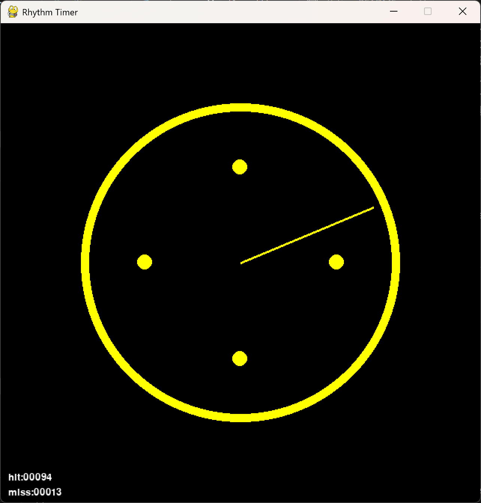
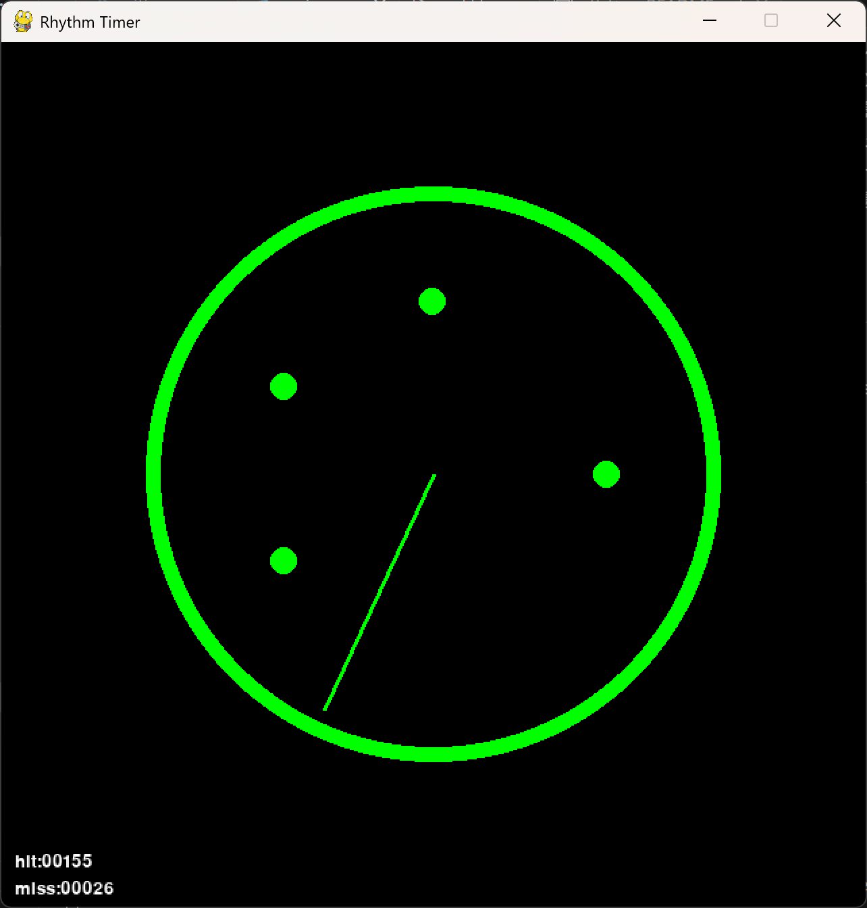

# Rhythm Timer

## 作品概要

この作品はタイマーをモチーフにしたリズムゲームです．プレイヤーはタイミングを合わせてキーを押すだけというシンプルな操作感でありつつも，曲に合わせてタイマーの色が変化したり，針の進む速度が変わったりするという，やりごたえのあるギミックも実装されています．開発の経緯については，pygameを使用して，なにかゲームを作りたいと考えながら腕時計をふと見た時に，動いている秒針と時間を示す目盛りを見て，この動きを用いたリズムゲームを作ったら面白そうと考え，本ゲームの制作に至りました．このゲームの開発において苦労したのが，ノーツ(タイミングを視覚的に表示する丸)の位置を設定しながら，色や速度の変更のタイミングを設定することと，針がノーツを通過するタイミングが再生されている曲の音とずれないようにすることでした．前者においては，ノーツのタイミングを管理するリストに色は文字列，速度の変化は少数として配置し，実際の処理を行う際にリスト内の要素の型に応じて処理を変更するようにしました．後者においては，一定の時間間隔で一瞬の遅延処理を行いつつ，プレイ中にミスをしてしまった時にも遅延処理を行うようにしました．しかし，この方法だと，リズムゲームが苦手な方が，意図せず遅延処理を引き起こしてしまうという問題があり，遅延処理については改善していきたいと思います．




## 動作環境

- Python 3.13
- Windows (他のOSで動作するかは不明)

## 使用ライブラリ

- pygame

## 実行方法

### 1. pythonのインストール

[ここから](https://www.python.org/downloads/)python 3.13をインストールします．

### 2. 仮想環境の構築

以下のコマンドを入力して，仮想環境を構築します．

```bash
python -m venv .venv
```

```bash
.venv/Scripts/Activate.ps1
```

### 3. ライブラリのインストール

以下のコマンドを入力してpipを最新のものにします．

```bash
python -m pip install --upgrade pip
```

次に，以下のコマンドを入力してライブラリをインストールします．

```bash
pip install -r requirements.txt
```

### 4. ゲームの実行

以下のコマンドを入力することでゲームを始めることができます．

```bash
python main.py
```

## プレイ方法

ゲームを実行すると，タイマーが表示されます．「ピッ」というカウントダウンの後に，タイマーの中に塗りつぶされた丸(以下ノーツ)が表示されます．


タイマーの針がノーツと重なるタイミングで，


任意のキーを押下すると，Hitとなり，左下に表示されるhitの数字が1増えます．


針がノーツを通り過ぎてしまうと，Missとなり，missが1増えます．

## 制作期間

2025/12 ~ 2026/01

## 使用させていただいた音楽

Polygons
by Riya ([Youtubeリンク](https://www.youtube.com/@Riya440Hz))

## ディレクトリ構成

```
.
├── assets/         #効果音やBGM
├── codes/          #ゲームの処理
├── docs/           #README.md用の画像素材
├── main.py         #エントリーポイント
└── README.md       #本ドキュメント
```
